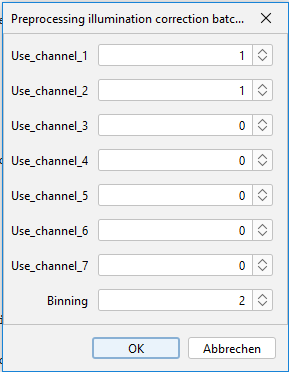

# Gabriel-et-al_2025_CircLentiReporter
Scripts used for data analysis and preprocessing as used in the manuscript "A lentiviral fluorescent reporter to study circadian rhythms in single cells" published on "BioRXIV"

# Fiji Macros

  ## Calculation_illumination_correction.ijm

OBJECTIVE:
  - calculates an illumination function from a stack of (multicolor) microscopy images, which can be used to correct uneven illumination.

INPUTS:
  - input image stack should have multiple images of backgroud recordings (e.g. image medium only) recorded with the same settings as the expreimental images

FUNCTION:
  - for each color,
    - for each each picture:
      - picture is median filteres (radius=5)
      - picture is mean filterd (radius=40)
      - from the filtered(=blurred) image, relative intensity is calculated, maximum is set to 1
    - the average of all relative intensities is calculated by Z-projection
    - this 'correction_function' is stored as a .tif file and can be used for illimunation correction
   
  ## Preprocessing_illumunation_correction_batch_32bit.ijm

OBJECTIVE 
  - corrects for uneven illumiation using 'correction_functions'
  - subtracts background
  - (optional) applies binning (2x2) or (4x4) using average

INPUTS 
  - which channel(s) of original images to process and store in the preprocessed files
  - whether to apply binning (can be 0 = no binning, 2, 4)
  - input folder with .tif, .tiff or .nd2 files to process (file dialog will open)
  - correction_function for each channel to process (file dialog will open)

    
  FUNCTION
  - converts image to 32-bit
  - corrects the input files illumination by dividing each image by the relative pattern
  - then detects the background level per image as the modal value of a blurred (Gaussion with radius = 50) 16bit image
  - subtracts this value from the image
  - stores the preprocessed stack
  - also stores all background values per stack in a csv files

# Tracking
  - cells were tracked using TrackMate Batcher v1.4.1 plugin of ImageJ 1.54p
  - Segmentation: Stardist, size filter 3µm
  - Tracking: LAP, maximal rnge: 30 µm, no gaps allowed
  - exported spot table

# TrackMatePostGui
  OBJECTIVE
  - tracking is not error free, so TrackMatePostGui is to qualtiy control tracks and filter for minimal length
  - Optimized for U2OS cells, an histone-based tracking marker, and an imaging interval of 1h
  BASIC CONCEPT
  - cells are tracked by a histone based tracking marker, thus signal condenses when cells devide
  - jumps in object size or tracking marker intensity usually point to wrong segmmentation or tracking (or edge effects)
  - however, when cells divide, changes in traking marker or size ARE normal
  - script detects cell divisions as simultatneous/subsequent peaks in tracking marker and shrinkage in size
  - size jumps and tracking marker jumps NOT related to division are FLAGed
  - tracks are kept if number of timepoints between to FLAGs are > minimum length, otherwise filtered out
  - tracks are also filtered out if detected divisions are closer than 15 h (probably not both division events)
  - data at timepoints of division is extrapolated from surrounding time points
  
  ==> For mor details, see /TrackMatePostGui/README.md 

  
