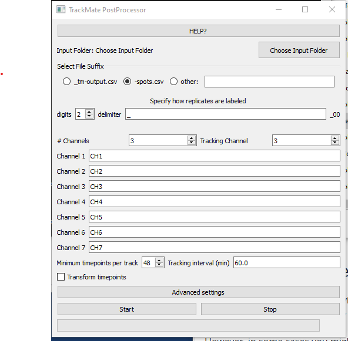
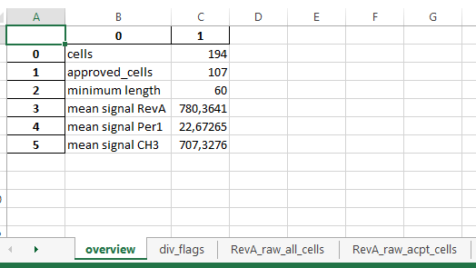
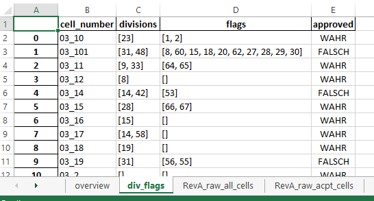
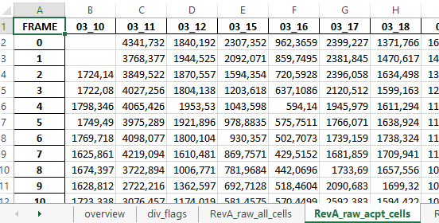
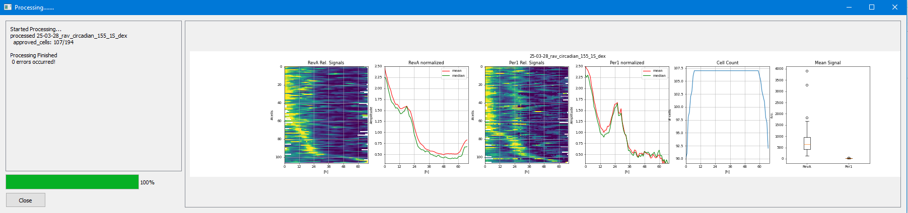
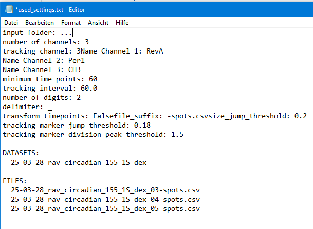

# TrackMatePostGui
 Postprocessing of Trackmate Output files including QC, GUI

## [build]: 

   working environment.yml provided in env folder. 
   Written in Python 3.9
   Dependencies: PyQT5, Pandas, Matplotlib, openpyxl 

## [install/run]:

    with conda:
     ==> cd .../TrackMatePostGui/env
     conda install env environment.yml
     conda activate TrackMatePostGui
     python main.py

    

  ## OBJECTIVE
  
  - tracking is not error free, so TrackMatePostGui is to qualtiy control tracks and filter for minimal length
  - Optimized for U2OS cells, an histone-based tracking marker, and an imaging interval of 1h
  ## BASIC CONCEPT
  
  - cells are tracked by a histone based tracking marker, thus signal condenses when cells devide
  - jumps in object size or tracking marker intensity usually point to wrong segmmentation or tracking (or edge effects)
  - however, when cells divide, changes in traking marker or size ARE normal
  - script detects cell divisions as simultatneous/subsequent peaks in tracking marker and shrinkage in size
  - size jumps and tracking marker jumps NOT related to division are FLAGed
  - tracks are kept if number of timepoints between to FLAGs are > minimum length, otherwise filtered out
  - tracks are also filtered out if detected divisions are closer than 15 h (probably not both division events)
  - data at timepoints of division is extrapolated from surrounding time points
  
  ## INPUTS

==> GUI expects files to be named in a machine readable way. It can combine replica files to datasets if they have the exactly same name and end in replica numbers (e.g. "_01", "_02" and so on). If that does not work, set replica digits to 0 to not combine files into datasets
- Choose an input Folder (output folder of batcher)
- Select the file suffix (“-spots.csv” for batcher data)
-	Define replica digits(e.g.: “00”)/delimiter(e.g.:”_”)
    -	This is expected to be the final number before the file suffix, and has to have the same number of digits for all files, separated from the rest of the file name by the delimiter. All files having the same name except the replica number are combined into one dataset
    -	When input folder is selected and everthings alright with the naming, number of files and datasets are depicted

     -

 	  -	If anything is wrong, an error text will appear
      - double check/adapt suffix/digits/delimiter pattern
      - check the highlighted file for naming error, rename or remove this file from the folder
      - update by changing forth and back digits number
    -	change digits to 0 if you do want each file to be analysed separately
     -	==> also a fallback option if dataset detection fails
-	define number of channels, and which of them is the tracking channel 
  -	You can name channels here e.g. to have colors displayed on overview plots
  -	Maximum is 4 digits (limit of excel sheet name!)
-	Define minimum time points for tracks to be kept
-	Define tracking interval (default is 60 min)
-	If using very short tracking intervals (<35 min), enabling “Transform Timepoints” may improve accuracy of QC, as settings are optimized for an interval of 60 min. Quality control will then use only timepoints in an interval of close to 60 min to evaluate accurate tracking. 
-	Advanced settings can also be modified to optimize accuracy, but performance should be evaluated with caution. May be necessary to adapt to other cell lines, tracking marker or imaging interval. As of to date, default advanced settings can only be changed within the python script. 

  ## OUTPUTS
  
  - one excel file per dataset (or per file if digits is set to 0) with multiple sheets:
    - overview of QC process

      

    - div_flags: all cell numbers with timepoints of divisions, FLAGs and whether they are approved

          

    - per color:
      - raw time series of all cells
      - raw time series of approved cells
      - raw time series of approved cells, with extrapolated values at division time points
      - normalized time series of approved cells, with extrapolated values at division time points
        
  - overview plots from normalized data for each data set

  

  
  - a "used_settings.txt" file including all settings and a list of processed files

  

 ## TEST

 download the test data (three .csv files) and process using the GUI
